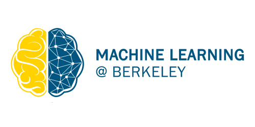

# Video Gesture Recognition and Overlay (Using Machine Learning and Computer Vision)
# About
Video Gesture Overlay is a machine learning and computer vision based application that is able to recognize hand gestures and facial tracking, and subsequently display corresponding reacts/icons overlaid on the user’s camera feed. 

# Motivation
As students at UC Berkeley all our classes were held on Zoom amid the COVID-19 pandemic. We often found it quite unnecessary for one to unmute themselves over video calls to simply say a quick word or two such as "yes" or "I agree". Additionally, privacy is becoming an increasingly prevalent issue in this day and age, so when a user steps away from the camera, our software automatically covers up the entire video feed to prevent one’s background from being exposed, and subsequently unhides when it detects the user come back into view. Inspired by our frustrations and observations with video-based learning, we created this application to convey quick messages using icon reacts without having to interact with computer hardware at all. 

# Dataset
We used the "ASL Alphabet" dataset from Kaggle which can be found [here](https://www.kaggle.com/grassknoted/asl-alphabet).

# Visual Model

# Credits
Hand Tracking Module: Victor Dibia, HandTrack: A Library For Prototyping Real-time Hand Tracking Interfaces using Convolutional Neural Networks, https://github.com/victordibia/handtracking

- Created by Ashwat Chidambaram, Andre He, Aryia Dattamajumdar, and Sarvasv Kulpati (in Fall 2020)
- [Machine Learning at Berkeley (ML@B)](https://ml.berkeley.edu/), as part of the New Member Education Program (NMEP) 

# Extra
Our project was also featured on the official Weights & Biases YouTube channel! Check out the video [here](https://youtu.be/WxVq0wJKh8o). The slides used in the presentation can be found [here](https://docs.google.com/presentation/d/1JEVe57uOlkCGvYdJILc8LzPAOJkpn-YeNbhT-dWdwTI/edit?usp=sharing).

